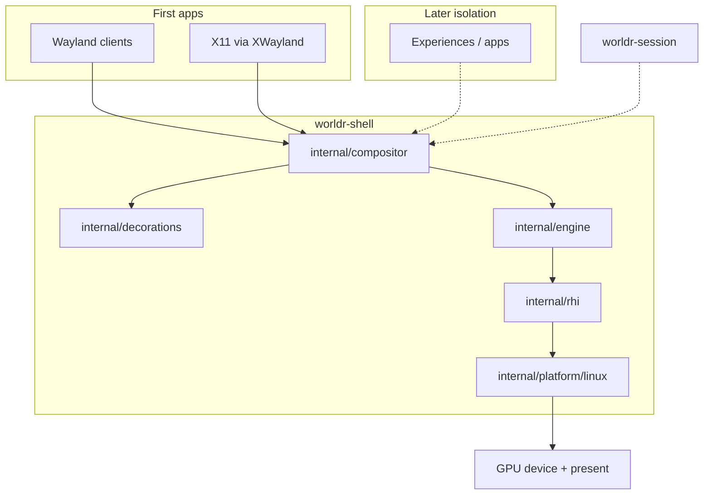

# worldr architecture

Phase 0 records locked product decisions. Implementation of the compositor and
Vulkan backend is explicitly out of scope until later build steps.

## Locked decisions

| Decision | Choice |
| --- | --- |
| Name | worldr |
| Vision | Linux-first cinematic desktop = owned Vulkan engine + Wayland compositor + UI toolkit (toolkit **deferred**) |
| Look | Compiz-like futuristic window theater |
| Decorations | Server-side decorations (SSD) for **foreign and native** apps |
| Clients | Wayland clients + X11 via XWayland |
| Language | Pure Go as far as possible; cgo/FFI only at Vulkan / OS / Wayland ABI boundaries |
| Not a second codebase | No Smithay, wlroots, Rust, or C++ compositor stack |
| GC | Frame loop must be allocation-disciplined |
| Compositor posture | Real Wayland compositor from day one (DRM/KMS + Vulkan present), **not** nested-as-client first |
| Graphics | Thin owned RHI over Vulkan |
| Engines we are not | No Unity, no Unreal |
| wgpu | **Not** the foundation; optional tools only |
| GPUs in scope | Linux NVIDIA, AMD, Intel |
| First bring-up | Intel Arrow Lake iGPU on machine **abox** (Mesa 26.2.2, Vulkan 1.4) |
| Process model (later) | Shell compositor owns GPU device + present; experiences/apps isolated; DMA-BUF + explicit sync |
| UI toolkit | **Deferred.** Compositor and engine first. Foreign Wayland/X11 clients are the first apps |

## Near-term build order

0. This scaffold (docs, license, module layout)
1. DRM/KMS + Vulkan clear-to-screen in Go
2. Minimal Wayland server (surface → textured window actor)
3. SSD borders + input/focus
4. XWayland
5. Compiz-style effect graph
6. Revisit UI toolkit

## Layers



ASCII:

```
Wayland clients ──┐
                  ├──► compositor ──► decorations (SSD)
X11 / XWayland ───┘         │
                            ▼
                     engine (scene,
                     window actors,
                     later effect graph)
                            │
                            ▼
                     rhi (Device, Queue,
                     Texture, SharedImage,
                     Sync, Present)
                            │
                            ▼
                     platform/linux
                     (DRM/KMS + Vulkan ABI)
                            │
                            ▼
                     GPU device + present

worldr-session (later): session / isolation around the shell
```

The shell compositor process owns the GPU device and the present path. Isolated
experiences/apps are a later process model; they will share pixels with DMA-BUF
and explicit sync, not by opening the DRM device themselves.

## Package responsibilities

| Package | Role |
| --- | --- |
| `cmd/worldr-shell` | Compositor binary. Will own device + present + Wayland server + frame loop. |
| `cmd/worldr-session` | Session manager placeholder. Isolation and session lifecycle come later. |
| `internal/rhi` | Owned RHI interfaces only: `Device`, `Queue`, `Texture`, `SharedImage`, `Sync`, `Present`. No Vulkan in Phase 0. |
| `internal/compositor` | Wayland server + XWayland. Maps client surfaces to engine actors. |
| `internal/engine` | Scene and window-actor model; later Compiz-style effect graph. |
| `internal/decorations` | Server-side decorations for foreign and native windows. |
| `internal/platform/linux` | DRM/KMS + Vulkan at the OS ABI boundary. cgo/FFI lives here later. |
| `internal/version` | Version / phase string for placeholder binaries. |

## Non-goals (Phase 0 and near-term)

- Implementing the compositor, Vulkan backend, or DRM/KMS bring-up in this scaffold
- Nested Wayland-client prototype as the first present path
- Smithay, wlroots, or any Rust/C++ compositor as the core
- Unity, Unreal, or wgpu as the rendering foundation
- Shipping a UI toolkit or widget library before compositor + engine exist
- Client-side decorations as the default chrome
- Vendoring large dependency trees
- macOS / Windows as first-class targets

## Vendor bring-up

Linux NVIDIA, AMD, and Intel are all in scope.

**First target:** Intel Arrow Lake iGPU on machine `abox`.

- Mesa 26.2.2
- Vulkan 1.4

Phase 1 should clear a color to that display through DRM/KMS + Vulkan in Go
before any Wayland protocol work. Other vendors follow once the Intel path
presents reliably.
