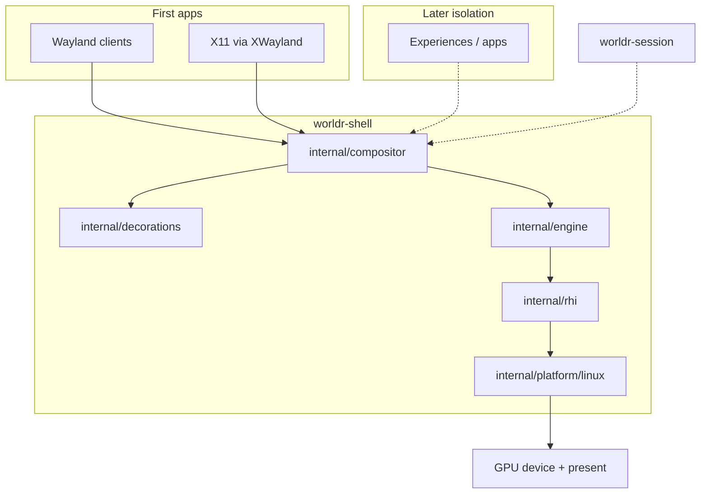

# worldr architecture

Locked product decisions plus the Phase 1–3 implementation notes for the first
tryable `worldr-shell`.

## Locked decisions

| Decision | Choice |
| --- | --- |
| Name | worldr |
| Vision | Linux-first cinematic desktop = owned Vulkan engine + Wayland compositor + UI toolkit (toolkit **deferred**) |
| Look | Compiz-like futuristic window theater |
| Decorations | Server-side decorations (SSD) for **foreign and native** apps |
| Clients | Wayland clients + X11 via XWayland |
| Language | Pure Go as far as possible; cgo/FFI only at Vulkan / OS / Wayland ABI boundaries |
| Not a second codebase | No Smithay, wlroots, Rust, or C++ compositor stack |
| GC | Frame loop must be allocation-disciplined |
| Compositor posture | Real Wayland compositor from day one (DRM/KMS + Vulkan present), **not** nested-as-client first |
| Graphics | Thin owned RHI over Vulkan |
| Engines we are not | No Unity, no Unreal |
| wgpu | **Not** the foundation; optional tools only |
| GPUs in scope | Linux NVIDIA, AMD, Intel |
| First bring-up | Intel Arrow Lake iGPU on machine **abox** (Mesa 26.2.2, Vulkan 1.4) |
| Process model (later) | Shell compositor owns GPU device + present; experiences/apps isolated; DMA-BUF + explicit sync |
| UI toolkit | **Deferred.** Compositor and engine first. Foreign Wayland/X11 clients are the first apps |

## Near-term build order

0. Scaffold (docs, license, module layout) — done
1. DRM/KMS + Vulkan clear-to-screen in Go — done
2. Minimal Wayland server (surface → textured window actor) — done
3. SSD borders + input/focus — done (simple chrome)
4. XWayland — done (`--xwayland`, tiny XWM + `xwayland_shell_v1`)
5. Compiz-style theater v0 — done (hardcoded map/unmap scale+fade)
6. Expose/overview v0 — done (F12 grid)
7. Panel + launcher v0 — done (bottom bar, F1 spawn)
8. Workspaces — done (2–4 desktops, pager N/M, slide, move-window)
9. TTY/seat harden — **this branch** (spare VT vk-display/drm)
10. Revisit UI toolkit

## Layers



ASCII:

```
Wayland clients ──┐
                  ├──► compositor ──► decorations (SSD)
X11 / XWayland ───┘         │
                            ▼
                     engine (scene,
                     window actors,
                     later effect graph)
                            │
                            ▼
                     rhi (Device, Queue,
                     Texture, SharedImage,
                     Sync, Present)
                            │
                            ▼
                     platform/linux
                     (DRM/KMS + Vulkan ABI)
                            │
                            ▼
                     GPU device + present

worldr-session (later): session / isolation around the shell
```

The shell compositor process owns the GPU device and the present path. Isolated
experiences/apps are a later process model; they will share pixels with DMA-BUF
and explicit sync, not by opening the DRM device themselves.

## Package responsibilities

| Package | Role |
| --- | --- |
| `cmd/worldr-shell` | Compositor binary. Will own device + present + Wayland server + frame loop. |
| `cmd/worldr-session` | Session manager placeholder. Isolation and session lifecycle come later. |
| `internal/rhi` | Owned RHI interfaces (`Device`, `Queue`, `Texture`, `SharedImage`, `Sync`, `Present`). |
| `internal/compositor` / `wlsrv` | Pure-Go Wayland server: xdg_shell, seat/keyboard, linux-dmabuf, SSD decoration, viewporter stub. shm + dmabuf → actors. |
| `internal/engine` | Scene, window actors, workspaces, CPU BGRA composite. |
| `internal/decorations` | SSD: thicker accent bar, title gradient, focused glow + title hit region. |
| `internal/platform/linux/native` | **cgo ABI**: `libvulkan` + `libdrm` (owned C session, not a second compositor). |
| `internal/platform/linux/wlclient` | Debug nested Wayland *client* (wl_shm). Not the primary path. |
| `internal/shell` | `worldr-shell` flags, safety, present loop, panel, launcher. |
| `internal/icontheme` | XDG icon-theme PNG/SVG (`Inherits=` + hicolor). Optional CGO `librsvg-2.0` (`-tags=librsvg`); else simple raster. |
| `internal/syncobj` | linux-drm-syncobj timeline points + DRM ioctl wait/signal (implicit fallback). |
| `internal/input` | Best-effort evdev pointer + keys. Quit is Ctrl+Q in the shell. |
| `internal/wayland` | Wire protocol encode/decode. |
| `internal/version` | Version / phase string. |

## Vulkan binding choice

Phase 1 uses a **thin owned C wrapper** in `internal/platform/linux/native`
(`vk_session.c`, `drm_session.c`) linked with `pkg-config: vulkan libdrm`.

Rejected as the foundation:

- `lukem570/vulkan-go` — current, Vulkan 1.4, no cgo, but **does not generate `VK_KHR_display`**, and requires `CGO_ENABLED=0` (incompatible with libdrm cgo).
- `vkngwrapper` — cgo, heavier, Vulkan 1.2-oriented.
- wgpu / Unity / Unreal — locked out.

`VK_KHR_display` is the primary GPU present path (`--backend=vk-display`).
`--backend=drm` is a libdrm dumb-buffer KMS path (CPU blit) if display WSI fails.
`--backend=wayland-client` is the **safe nested demo**. `--backend=vk-display`
is the real-display path on a spare TTY (`scripts/try-tty.sh`).
`--backend=headless` is for CI / no `/dev/dri`.

## linux-dmabuf

`zwp_linux_dmabuf_v1` (v4 feedback + v3 format/modifier events) is advertised.
LINEAR buffers mmap on the compositor. Tiled Intel modifiers
(`X/Y/Yf/4_TILED`) are imported with `VK_EXT_external_memory_dma_buf`.
On `vk-display`, ARGB/XRGB imports are retained as `VkImage` and blitted
onto the swapchain after the CPU desktop upload (implicit dma-buf sync).
Readback / mmap remain for nested, drm, ABGR, and theater. shm is the
fallback. Fullscreen ARGB/XRGB on `--backend=drm` can skip the blit via
KMS primary-plane scanout (`internal/scanout` eligibility + atomic/`SetCrtc`).
`vk-display` evaluates the same helpers then falls back (Vulkan holds DRM
master). `wp_linux_drm_syncobj_manager_v1` is advertised when
`DRM_CAP_SYNCOBJ_TIMELINE` is present; acquire/release fds are imported and
a DRM timeline wait is attempted, else implicit sync. Vulkan timeline wait
is later. Overlay planes are later.

## Present / compositor loop

On `vk-display` with no clients: `vkCmdClearColorImage` + present (GPU clear).
When clients exist (or on `drm` / nested client): CPU BGRA framebuffer → blit
actors + SSD → upload (`vkCmdCopyBufferToImage`) or dumb-buffer memcpy.

## Non-goals (still)

- Nested Wayland-client as the *primary* compositor path (debug only)
- Smithay, wlroots, or any Rust/C++ compositor as the core
- Unity, Unreal, or wgpu as the rendering foundation
- UI toolkit
- Client-side decorations as the default chrome
- Vendoring large dependency trees
- macOS / Windows as first-class targets
- Full Compiz effect-graph plugin system (v0 is hardcoded map/unmap/focus)
- Full EWMH / ICCCM XWM (0.9.11 has `_NET_*` basics, titles/class, focus/stacking, OR/transient no-SSD — not reparenting/pager/IME)

## Vendor bring-up

Linux NVIDIA, AMD, and Intel are all in scope.

**First target:** Intel Arrow Lake iGPU on machine `abox`.

- Mesa 26.2.2
- Vulkan 1.4

Phase 1 should clear a color to that display through DRM/KMS + Vulkan in Go
before any Wayland protocol work. Other vendors follow once the Intel path
presents reliably.
