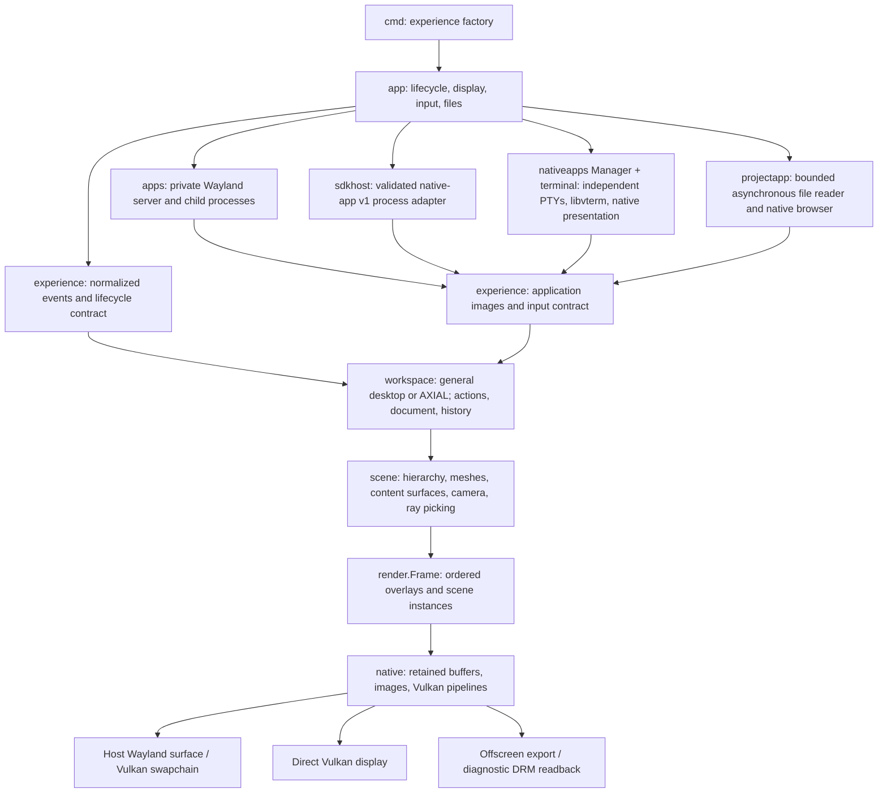

# worldr: native scene foundation

worldr treats models, documents, instruments, and data as interactive content in
one environment. The 0.10 reset replaces the former CPU window compositor with
an explicit host/experience boundary and a retained GPU scene pipeline.

## Current implementation

| Package | Responsibility |
| --- | --- |
| `cmd/worldr-shell` | Chooses the experience factory and installs shutdown signals |
| `cmd/worldr-session`, `internal/session` | Validates display-manager session state, prepares XDG environment and supervises the shell |
| `internal/app` | Owns one experience, display lifecycle, input normalization, timing, snapshots, native sessions, autosave/recovery and document files |
| `sdk/nativeapp/v1` | Public versioned lifecycle, retained-resource, input/IME and semantic contract for external native apps |
| `internal/sdkhost` | Launches SDK processes, isolates framed I/O, validates resources and adapts them to application surfaces |
| `internal/accessibility` | Validates and streams bounded native semantic snapshots over a private Unix socket for external adapters |
| `internal/experience` | Platform-independent events, metadata, lifecycle, and optional persistence/demo contracts |
| `internal/presentation` | Shared Cinematic/Adaptive preference independent of content and display protocols |
| `internal/terminal` | Native PTY process, libvterm cells, XKB/compose, key repeat, terminal input and history |
| `internal/nativeapps` | Native terminal manager, independent providers, cell selection, retained image updates and application contract |
| `internal/projectapp` | Read-only native directory/text browser, bounded asynchronous file access and copy-path clipboard |
| `internal/resourcepath` | Validated local resource paths, descriptor-to-path identity checks and safe reopen helpers |
| `internal/workspace` | General application workspace, hosted or standalone AXIAL study, spatial drag/throw, explicit portal navigation, semantic actions, separate saved documents and undo/redo |
| `internal/scene` | Hierarchical transforms, meshes and content planes, GPU instance submission, camera math, ray/BVH picking, texture-coordinate input mapping, and 2D canvas/text |
| `internal/render` | Immutable geometry, versioned RGBA images, atlas data, scene instances, and ordered frame commands |
| `internal/platform/linux/native` | Vulkan resources, shader pipelines, swapchains, submission, and DRM ABI |
| `internal/platform/linux/host` | libwayland host window, XKB input, surface lifecycle and lazy desktop clipboard endpoint; generated XDG-shell bindings |
| `internal/platform/linux/apps` | Private libwayland server, transactional SHM/DMA-BUF surface trees, seat/input, XDG toplevels/popups, clipboard and drag-and-drop |
| `internal/platform/linux/xwayland` | Authenticated private Xwayland/XWM process, exact surface association, capability-gated glamor with SHM fallback, X11 focus/configure/close policy, lazy `CLIPBOARD` relay and bounded copy-only XDND routing |
| `internal/platform/linux/seat` | libseat session lifecycle and libinput/udev device ownership for direct display |
| `internal/input` | Managed libinput translation plus the diagnostic evdev reader used by isolated tests |

## Rendering and resource ownership

`scene.NewMesh` validates and copies indexed object-space geometry. A mesh owns
an immutable renderer resource and a CPU acceleration structure for picking.
The Vulkan backend uploads that resource on first use and reuses its buffers.
Moving an object changes instance constants rather than regenerating projected
triangles. The GPU applies model/camera matrices, normal transforms, directional
lighting, and barycentric wire coverage.

Each mesh instance can supply `render.Material` values for specular strength,
roughness, metal-colored highlights, a view-dependent colored rim and thin-glass
transmission. Parameters
are finite values in [0,1], with effective roughness bounded below at 0.08.
Materials belong to individual nodes rather than inheriting through parents.
The zero value preserves diffuse lighting, and unlit meshes and content images
ignore these effects. A camera can also carry four bounded point fill lights;
they update draw constants without rebuilding geometry. Transmission is limited
to depth-peeled meshes and provides a deterministic thin tinted surface rather
than backdrop refraction or blur. This lightweight direct-light model uses the
existing pass and adds no readback.

`scene.NewMeshWithNormals` accepts owned, validated normals per source vertex.
They change lighting without changing the geometry or picking bounds. AXIAL uses
radial normals on cylindrical walls and separate hard normals on caps, seams
and blades. Its blue/silver materials and cyan rim accents are presentation
choices on top of those generic engine capabilities.

`render.Frame` preserves the order of overlay and camera commands. Overlays use
dynamic screen-space triangles and an R8 glyph-coverage atlas. A scene command
supplies a viewport, view-projection matrix, lighting, and mesh/surface instances,
with its own depth clear. Content surfaces and native objects belong in the same
scene command so that their depth tests agree. Later overlays draw above the
scene without borrowing depth ranges or relying on transparent edges to write
depth. Glyph coverage and line
fringes provide local coverage. Where exact color/depth formats and sample-rate
shading support it, all targets use 4× MSAA with per-sample overlay shading;
other devices use 1×. Mesh and content texture shaders retain their normal
shading rate. Linear frames resolve to RGBA16F, then a shared presentation shader
performs optional exposure, saturation, contrast, a filmic SDR shoulder and a
fixed 13-tap highlight bloom before sRGB encoding. The zero transform preserves
the established output. Physical scanout remains SDR sRGB; ICC profiles,
wide-gamut output, display calibration and HDR signaling remain separate work.

`Canvas.RadialGradient` uses one bounded triangle fan with interpolated straight
RGBA and the atlas's white texel. AXIAL uses it for the ambient halo instead of
ten overlapping discs. Short runs with the same render extent showed reduced
CPU submit/wait time while preserving 4× MSAA; exact commands, observations and
measurement limits are in [performance observations](docs/PERFORMANCE.md).

Meshes can explicitly set `DepthReadOnly` for translucent guides. Within each
camera command, scene submission stably defers these meshes until after regular
meshes and opaque content. Their pipeline tests depth but does not write it;
callers own the blend order among overlapping translucent meshes. This keeps
faint stage lines from hiding content behind them. The default mesh behavior
is unchanged, and opaque content surfaces reject this flag.

Meshes can also author an independent `Glow` RGB value, with finite channels in
[0,1]. Zero disables emission; content textures cannot emit. Each emitting camera
gets a depth-tested half-resolution coverage pass and a separable blur. Its halo
is composited at that camera's position in the command stream, behind its normal
scene draws and clipped to its viewport. Opaque application pixels remain sharp
and unchanged; later overlays and cursors keep their order. Hidden geometry
does not seed the blur. This is a background glow effect in the existing color
space. A separate final-frame highlight bloom and SDR output transform can
respond to bright composed pixels; authored glow remains depth-aware and scoped
to its camera.

Effect resources are allocated lazily and retained across frames, with a limit
of four emitting camera commands per frame. Exceeding the limit is an explicit
frame error. Frames with no authored emission skip all effect passes. Target
resize and session teardown release the associated images and pipelines; the
effect adds no CPU image readback. The seed pass reuses the main multisample color
and depth attachments at a smaller framebuffer extent, preserving the selected
sample count. Added images are all half-resolution: one seed, one horizontal blur,
and one final halo per used camera. At 2880×1800, their nominal RGBA8 storage is
15.6 MB for one camera and 31.1 MB for four, excluding driver allocation overhead.
AXIAL authors emission on active application
borders, sparse guides and housing light bands. Adaptive focus removes their
glow while retaining a crisp application focus border.

The experience and renderer run on one host goroutine. Frame slices are borrowed
until the next draw/close; the host submits them before allowing mutation. Atlas
pixels and geometry remain immutable. `render.Texture` owns a full RGBA8 image
and a revision. A consumer on the preceding revision uploads only the latest
damage rectangle; a new or stale consumer obtains the full current image. This
keeps independent interactive and snapshot renderers correct. Replacement can
resize a texture without changing its resource identity. Frame content must
remain stable through submission even though texture access is synchronized.

Meshes and textures have explicit backend release; closing the Vulkan session
releases its remaining GPU allocations. Swapchain
resize preserves the device and retained scene resources. Presentation teardown
waits for device idleness before destroying resources; driver waits have no
promised finite shutdown deadline.

Picking casts a camera ray through the scene hierarchy, transforms it into each
mesh's local space, and intersects its BVH. Hits include stable scene node and
source-triangle identity plus world coordinates. Surface hits instead include
top-left image coordinates. A content plane is a two-sided unit XY quad centered
at the origin; its model transform determines size and placement. Surface and
mesh hits compete on the same world-distance scale. Captured pointer mapping
can continue outside the quad and through an occluder; an initial pick must hit
the visible surface. `MapCapturedSurface` additionally extends an established
gesture beyond the viewport while preserving the camera depth range. Picking
does not reconstruct or rasterize all projected triangles on the CPU.

The first surface policy is opaque: RGBA8 UNORM images supply RGB, multiplied by
the node's RGB tint, with alpha ignored and depth writes enabled. Picking treats
the complete quad as opaque too. Hidden nodes and zero inherited node opacity
still hide the subtree. This is not an intersecting-transparency implementation.
The live AXIAL panel rasterizes its linked synthetic instrument data to a cached
image and uploads changed content. It exercises rendering and input mapping;
it does not embed or impersonate a terminal process.

## Host and experience contract

The application host receives an experience factory at the executable boundary.
It does not import AXIAL, its component names, keyboard bindings, or demo script.
The experience supplies its identity, title, controls, atlas, updates, and frames.
Platform adapters translate input into normalized keys/modifiers and explicit
pointer down/move/up/cancel events. Physical evdev keys, XKB keymaps and modifier
masks, repeat settings, mouse buttons and scrolling also cross this boundary
for application adapters. Keyboard focus loss and pointer cancellation are
separate events. A cancel is not a synthetic click or release.
The host owns quit/save shortcuts, display resources, and filesystem access.

Direct-display evdev input uses a bounded nonblocking queue of complete device
reports. Available reports merge by timestamp before event-time pointer and US
modifier conversion, preserving click/key order, all mouse button codes and both
wheel axes. High-resolution wheel deltas replace their duplicate legacy values.
Input loss cancels keyboard focus/repeat and pointer capture; incomplete reports
are discarded. Synthetic pipes test the reader and application routing without
physical device access. Production direct mode uses libseat and libinput/udev,
including input hotplug and absolute devices. It still uses default US XKB and
25 Hz / 600 ms application repeat; importing pre-existing seat lock/held state
is not implemented.

AXIAL routes tree selection, object picking, keys, gestures, and demonstration
steps through one semantic action reducer. Its versioned `Document` uses stable
component IDs and typed timeline/camera/view state. The explosion tween and GPU
handles are presentation state and are not serialized.

Camera zoom is a bounded, logarithmic distance adjustment stored in the camera
state. Its zero default preserves older documents. Scrolling over the spatial
scene changes this distance; app scrolling and placement-depth scrolling retain
their own routing. Read/Overview views keep their fitted camera. Zoom is undoable
without rewinding playback, and resetting the view restores the original distance.

The selected presentation mode is a persistent view preference. Cinematic keeps
spatial framing visible; Adaptive fades guides and calms wire/rim accents while
focused. AXIAL's procedural world-space grid and rings share the scene's camera
and depth and hide in application Read/Overview views. Adaptive focus fades them.
The fade itself is transient and does not change camera, document content, or
input semantics. Existing version-1 documents without the optional presentation
field default to Cinematic; explicit invalid values are rejected. Resetting the
study preserves the selected mode. The independent Reduced Motion preference
snaps explosion and framing interpolation to their target, including when enabled
during a transition. It is persisted and undoable, survives reset, and defaults
off for older documents. It changes neither the explicit playback clock nor app
content. Header controls and Shift+P invoke the same action.

AXIAL also persists the instrument panel's front/back placement. B and the depth
button invoke the same undoable action; older documents default to the rear
position. The panel's play and scrub controls use the study's existing timeline
actions, with one undo entry per completed scrub and cancellation on focus loss.

Undo records deliberate edits, with one record for an entire orbit or timeline
drag. Playback and animation ticks are excluded. Each record restores only the
fields that action changed: undoing selection does not rewind unrelated running
time. Cancellation restores an unfinished gesture. New edits discard the redo
branch; history is bounded and belongs to the live experience.

The optional `Stateful` contract serializes the experience payload. With an
explicit `--state` path, the host loads a versioned envelope containing the
experience ID and payload. Version 2 adds a validated native session manifest;
version-1 layout envelopes remain readable. Files are limited to 1 MiB. Saving validates JSON, writes a
same-directory temporary file with mode 0600, syncs it, atomically renames it,
and syncs the directory. Ctrl+S and normal exit cancel unfinished pointer
gestures before saving; no file is created by default. A successful load begins
with empty undo history.

The manifest records Files root/current directory/selection, the current photo
path, video path/position/pause/volume/mute, and native terminal slot keys and
working directories. It stores no commands or process memory. Terminal restore
starts fresh configured shells; legacy applications still require explicit
launch arguments or profiles. Root/file snapshots use open-descriptor identity
checks where available, so renamed resources can retain their current path.
Restoration publishes native surfaces before workspace reconciliation and does
not grant keyboard focus. Missing resources are reported and kept as pending
references while their placements remain; a missing Files subfolder recovers to
the root. Reopening a replacement or forgetting its closed placement discards
the corresponding pending association.

`Checkpointer.CheckpointState` supplies a non-disruptive host snapshot. With
`--state`, `--autosave=5s` writes `PATH.autosave` on one bounded background worker;
`--autosave=0` disables periodic writes. Unfinished gestures are excluded, and
released windows are captured without stopping their glides. A worker never
calls the experience. Startup prefers newer valid recovery, or valid recovery
when the primary is missing/invalid; invalid recovery falls back to a valid
primary with a notice. Both invalid candidates fail without changing the live
document. Manual saves flush pending writes before replacing the primary and
removing recovery. `--fresh` skips recovery and saved native content while loading
the primary layout and explicit CLI apps. An advisory `PATH.lock` prevents
concurrent sessions using the same state path; the kernel releases ownership on
exit or crash, while the lock file remains.

The experience contract remains internal and in-process. External native tools
use the separate public `sdk/nativeapp/v1` contract: a bounded framed process
protocol for retained texture/mesh resources, surfaces, input, IME and semantic
trees. `internal/sdkhost` validates and translates that data on the host
goroutine while a worker isolates pipe I/O from frame presentation. This is an
application lifecycle boundary, not a process sandbox or shared-document
service.

## Compatibility application path

An application-capable experience gets a private Wayland socket inside a 0700
temporary directory, including when it starts with no applications. `--app=foot`
launches a separate client process; native shells can launch further clients
later. Child environments replace the inherited display variables with the
private socket, while worldr retains its existing host display connection.
Arguments after `--` are passed directly to the executable, without an implicit
command shell. The server and native terminal manager remain separate providers.

The adapter copies committed SHM ARGB/XRGB buffers into protected immutable
snapshots. For supported one-plane explicit-modifier 8888/2101010
XRGB/ARGB/XBGR/ABGR DMA-BUF buffers, Vulkan waits for the implicit producer
fence and makes an owned LINEAR GPU snapshot without CPU readback. Exact pairs
are capability-gated; LINEAR and device-specific non-LINEAR input can coexist.
When the renderer supplies its validated DRM render node, linux-dmabuf v4
publishes a sealed exact-pair format table plus main-device and tranche-device
feedback for that node. The compatibility entry point without device identity
continues to expose linux-dmabuf v3.
Transactional subsurface generations preserve content, crop, input
regions, position and stacking. The application controller maintains retained
renderer textures and releases them after client disconnection. The
scene renderer sees generic images and transforms, not Wayland resource handles.
This compatibility upload is separate from rendering the entire workspace:
normal nested presentation still uses Vulkan WSI without scene readback.

Cursor images use a separate optional application contract. The compatibility
server validates the pointer-focused client and enter serial, and exposes a
committed premultiplied RGBA snapshot with logical hotspot and integer buffer
scale. The controller reuses one retained texture; hotspot-only updates do not
upload pixels. The hub remaps provider IDs, and the workspace selects the hovered
or captured application's cursor independently of keyboard focus. Hidden requests
remain scoped to that pointer route; leave/disconnect, overview, placement and
workspace help restore the arrow. Cursor buffers are bounded to 512 pixels per
axis. Basic cursor subsurfaces are clipped to that extent.

`render.ImageCommand` blends a retained premultiplied RGBA image in framebuffer
coordinates and command order without depth reads/writes. It supplies the cursor
overlay without changing opaque world-space content. GPU tests cover alpha,
orientation, clipping, ordering, partial uploads, resize and retirement; actual
foot/Chromium tests cover client cursor requests and the foot-to-GPU path.

AXIAL displays up to 32 live application windows. Surfaces compete with native
geometry for depth and picking. Clicking visible content grants keyboard focus;
an unmodified Enter from the workspace explicitly opens Read and focuses the
selected application, including a window hidden behind other content.
Pointer selection retains its target through occlusion and
beyond the viewport. Clicking workspace controls releases application focus.
Read/return changes the camera and temporarily hides the model, preserving the
saved placement and orbit. Compact/wide sends an application configure so the
terminal grid reflows; it does not change the surface's world width.

Application positions use a fixed world basis. Selected groups move together;
one placement drag produces one undo entry. Overview temporarily arranges all
live surfaces for retrieval without modifying their stored positions. Read mode
isolates the selected application. Ctrl+Alt+O opens overview even while an app
owns the keyboard, cancelling held keys and pointer capture first. Unmodified
arrows select live thumbnails using the displayed grid, one step per fresh press;
modified arrows are consumed without changing the timeline. Enter/keypad Enter
and Escape return to the prior space/read view without granting typing focus.
A second fresh Enter explicitly opens Read and grants focus. Workspace navigation
strokes keep their repeats and release until completion across view/focus changes,
so a held Enter cannot type into or focus the returned window. Keyboard focus
loss clears that held state.

Workspace F1 or the footer Help control opens a transient shortcut guide. Its
overlay owns input and cancels ongoing gestures and application capture. Held
keys stay consumed through dismissal; closing does not restore typing focus.
Focused applications keep their own F1. Guide visibility and input capture are
outside saved documents and undo.

Positions, group membership, selection and view/size preferences are saved and
undoable. Live protocol IDs, keyboard focus and processes are not serialized.
Repeated `--app` options identify launch slots; `--apps` profiles provide named
IDs and independent argument arrays that survive launch-order changes. Multiple
windows from one process receive separate window slots. Reopening a saved
document restores native resources through its manifest; legacy applications
still require matching launch arguments or a profile.

The optional `ApplicationLauncher` and `ApplicationCloser` contracts handle live
process actions outside document undo. New Terminal is available even with no
live surfaces; Ctrl+Alt+Enter invokes the same launch while an application has
focus. Main and keypad Enter work, with repeats and the matching release
consumed by the workspace. Close Selected targets only the active live ID and leaves its
surface present until the provider withdraws it. An in-workspace launch error
produces a bounded ten-second notice, outside the document and undo history.
The hub rejects launches at 32 live surfaces. Separately, old saved placements
can occupy all 32 layout slots: if a launched terminal cannot be placed, the
workspace closes only its newly created surface and restores the prior document.
Existing placements are never silently reassigned or removed to make room.

Forget Closed Placements is an explicit undoable document action, available
even with no live windows. It checks the complete provider surface list rather
than only visible or renderable surfaces, removes absent keys without compacting
live slots, and preserves their positions, groups and selection. It cancels an
unfinished gesture before recording the removal. Its history merge preserves
keys registered later; redo never removes a key that is live again. If undo
would exceed 32 retained placements, the operation is refused atomically with
a visible notice and unchanged history position. Other action merges keep their
existing behavior. The control shares the notice row with width-limited error
text, and is shown only when closed placements exist.

Focused applications receive ordinary keyboard shortcuts, including Ctrl+Q and
Ctrl+S. The reserved chords are Ctrl+Alt+Q for exit, Ctrl+Alt+O for overview and
Ctrl+Alt+Enter for a new native terminal. The seat receives modifier changes
even when no application has focus, preventing stale state on
the next focus transition. The protocol adapter ends held-key/button sequences
when focus or capture is canceled. Closing a legacy window sends
`xdg_toplevel.close`; a client may first display an unsaved-work dialog or decline
the request. Workspace shutdown requests all clients close, then allows a grace
period before disconnect and owned-process termination. Owned launch leaders
remain unreaped until their process groups have been signalled, preventing PID
reuse from redirecting cleanup. This does not promise cleanup of arbitrary
detached descendants. A normal client exit leaves other surfaces available.

Real foot tests cover pixels, independent shells, terminal resize/reflow,
grouping, overview, persisted layout, clipboard transfer and sibling survival
after exit. A clipboard broker relays MIME offers and file descriptors between
the private server and nested desktop; it does not eagerly read clipboard data.
Echo tokens prevent loops, stale offers produce EOF, and host publication waits
for a valid focused input serial. Exported sources survive host focus loss so
another desktop application can paste. Nested text-input-v3 drives native fields;
Wayland data drag-and-drop, private Xwayland and its bounded `CLIPBOARD`
selection bridge are integrated. Managed X11 windows additionally support
copy-only XDND versions 3–5 with direct XdndSelection payload transfer and
bounded completion. Primary selection, legacy-client IME, cross-protocol
X11/Wayland drag-and-drop, arbitrary DMA-BUF formats and broad application
compatibility remain unsupported.
This is not an application sandbox.

XDG popup positioners apply anchor/gravity and requested constraints within the
root image. XDG shell v3 explicit reposition sequences copy the positioner and
apply the new placement only after its configure is acknowledged; reactive
positioners reconstrain after committed ancestor-bound changes. Popup SHM images
flatten into the parent texture; input resolves the topmost popup in logical
coordinates. Outside presses dismiss grabbed menus
without falling through, and parent teardown releases descendant popups/grabs.
Separate XDG toplevel dialogs remain independent spatial surfaces. Chromium and
Konsole tests exercise real menus, nested submenus and dialog cleanup. Popups
outside the root image remain clipped; this is a documented compatibility limit.
Chromium probes use a separate profile, a local test page, Wayland Ozone and
software client rendering (`--disable-gpu`). Those probes do not establish
browser GPU acceleration or general desktop compatibility.

## Native terminal path

`nativeapps.Manager` starts without a shell. `--terminal`, Ctrl+Alt+Enter or a
completed New Terminal click creates a provider with its own real PTY and
libvterm 0.3+ state.
The manager supports up to 32 independent native terminals within the workspace
limits. Reusable launch slots preserve layout keys; monotonically increasing
runtime IDs prevent a reopened slot from receiving its predecessor's input.
Its worldr-owned presentation consumes immutable terminal cells,
cursor/title/exit state and bounded scrollback. XKB and compose translate raw
keys, with repeat scoped to keyboard focus. The terminal handles alternate
screens, terminal replies, resize, mouse reports and bracketed paste.
Its child environment points Wayland applications to worldr's private server,
so launching a compatible GUI from the shell creates another spatial surface.
The terminal itself does not render through that compatibility protocol.
Shell exit retains the final output. Explicit close terminates the owned shell,
retires its image and frees its launch slot. Selecting or launching a terminal
does not implicitly grant keyboard focus, and launch preserves the current
space/read presentation.

The provider draws changed rows using GoMono into a retained image; the scene
applies placement, depth and picking just as for other content surfaces. This
first display path uses CPU glyph rasterization and changed-image uploads.
Missing terminal glyphs resolve through Fontconfig on Linux, keeping Go Mono
for existing coverage and fixed cell geometry. Each renderer caches up to 4,096
rune/style resolutions and 16 fallback face locations; font reads are limited
to 32 MiB per regular file and 64 MiB retained per renderer. Renderers share a
reference-counted private Fontconfig configuration and release their owned faces
and configuration references on close. Non-cgo builds retain embedded fonts.
Installed font coverage is required; color emoji and variable-font instances
are not supported. General world-space glyph quads remain future engine work.
The provider preserves combining marks and wide cell coordinates; selection
currently separates visual rows with LF because soft-wrap metadata is absent.
Shared native controls and labels use Pango/HarfBuzz shaping and text-input-v3
IME. Terminal cells remain fixed-grid glyphs by design; terminal-program IME and
world-space vector glyph geometry are not implemented.

An application hub remaps provider-local live IDs, preserves document keys, and
routes focus/input/resize to the correct native or compatibility provider. A
clipboard broker shares ownership between these providers and the nested host.
Native copy owns the explicitly selected text. Native paste reads a requested
pipe off the render thread, bounded to 1 MiB and two seconds, then applies the
completed text on the owner thread. Closing the endpoint cancels pending I/O.
An asynchronous paste is bound to its original terminal: focus loss or window
close invalidates it even if that slot is later reopened or focus returns.
Native terminal output alone does not access the system clipboard. No clipboard
content is read simply because an offer becomes available.

## Native photo and media opening

Files hands explicitly opened video/image files to their native providers as
anchored read-only descriptors. The host checks both live-window capacity and
retained layout capacity before transferring ownership. Registering content does
not select it, grant keyboard focus or change the camera; Read remains an
explicit workspace action. Stable viewer keys preserve spatial placement.

`photoapp.Manager` owns one retained photo surface and one decode worker, with
one queued request and one completed result. Generation checks discard stale
results, while cancellation closes owned descriptors. Header dimensions and
encoded size are bounded before decoding; JPEG EXIF orientation is normalized
on the worker. A replacement preserves the old image until the new decode
succeeds, then withdraws the old runtime ID and retires its texture. Failed
loads remain a visible viewer status. A photo's texture follows the complete
image's aspect ratio within the requested display bounds; transparent image
pixels are composited over a checker. The native photo style adds only a left
bracket with partial top/bottom returns outside the image. `DragContent` lets
the workspace own placement/throw gestures on the image itself and suppresses
the grip and Overview title. Generic `Frameless` surfaces still omit all frames.
The provider has no manual zoom, pan or rotation controls
and publishes RGBA content only when it changes. Placement uses normal document
undo; photo decoding and replacement remain outside document history.

`mediaapp.Manager` uses libmpv for playback timing, audio and software video
decoding into retained RGBA content. Its poll loop runs independently of input
focus. Replacing a video closes the previous decoder before releasing its file,
keeps the same placement key and retires the old texture.

## Presentation backends

- **Nested:** libwayland owns an XDG toplevel and input; Vulkan WSI presents a
  swapchain directly to its surface. No CPU framebuffer or readback participates
  in ordinary nested presentation. XKB supplies logical keys and modifiers.
- **Headless:** Vulkan renders offscreen for tests and export. A missing Vulkan
  device is an error; software Vulkan is a driver choice, not a renderer fallback.
- **Direct display:** the Vulkan display path draws to a physical display target.
  The diagnostic DRM backend uses offscreen rendering followed by readback to a
  dumb buffer. Both require explicit device/seat access and separate validation.
- **Snapshot:** export re-renders the same document into an offscreen image,
  reads it back once, and encodes PNG. It does not force an interactive swapchain
  to expose readable images.

Generated XDG-shell C/header bindings and shader binaries are checked in beside
their integration/source. Ordinary builds use development headers/libraries for
Vulkan, libdrm, Wayland client/server, xkbcommon, libvterm 0.3+, Fontconfig,
Pango/Cairo and libmpv.

## Remaining work

The real multi-terminal and native-object workflow now includes spatial
placement, groups, overview retrieval, persistence and clipboard exchange.
Independent native terminals, in-workspace launch/close, and selected
Chromium/Konsole popup/dialog workflows are implemented. Files opens native
video and photo viewers and can start an independent terminal in a selected
directory. The application hub owns shared polling, teardown and texture
retirement. Native session restoration and autosave recovery pass integrated
GPU/native-content tests, race checks and a forced-stop recovery smoke test.
Hosted native 3D content, a file-backed OBJ/STL inspector, the linked research
workbench and the public native-app v1 SDK are integrated. Named spaces, shared
native controls, terminal history tools and independent viewers are integrated.
Broader compatibility remains future expansion. Physical platform qualification
is deliberately pinned in the product backlog.
See [the product brief](docs/WORKSPACE.md)
for acceptance criteria and the cinematic visual direction.

1. **Rendering quality:** linear SDR output, directional shadows and per-pixel
   transparency are implemented (see [limits](docs/RENDERING.md)). HDR output,
   richer materials/vector paths and physical input-to-photon measurements remain.
2. **Experience model:** AXIAL now also runs through the generic hosted native
   spatial-application contract with normal placement, depth, picking and session
   restore. More than one top-level experience, broader document resources and
   file references, semantic focus, resource budgets, process isolation, and
   deliberate application lifecycle remain. The host still runs one top-level experience.
3. **Everyday use:** shaped editable fields, nested IME, semantic focus trees
   and recoverable Files operations are implemented. Primary selection, an OS
   AT-SPI adapter and broader toolkit acceptance remain; the private native
   semantic stream is implemented.
4. **Platform:** nested fractional scaling/output lifecycle, bounded renderer
   recovery, libseat/libinput ownership, device/connector hotplug and an
   eight-output extended desktop are implemented. Physical multi-monitor, VT and
   suspend/resume qualification remains pinned. Direct input currently assumes a US
   keyboard; nested input uses the host keymap.
5. **Interoperability:** broaden toolkit and DMA-BUF format coverage beyond the
   tested foot, Chromium, Konsole, xmessage and single-plane
   XRGB/ARGB/XBGR/ABGR workflows.
   Wayland DnD, private Xwayland, X11 clipboard, capability-gated Xwayland
   glamor and managed X11-to-X11 copy drags are implemented; cross-protocol
   X11/Wayland drags and general application compatibility are not established.
6. **Additional input:** optional voice or gesture assistance should invoke the
   same inspectable semantic actions, with clear ownership and cancellation.

The retired CPU compositor, window effects, application protocol server and old
transport packages remain in Git history. The current
native scene and experience contracts do not depend on those packages.

## Workspace and direct manipulation

The CLI defaults to `workspace.NewDesktop`; its AXIAL provider lazily allocates
study resources for the launchable hosted tool and publishes them only while
that tool is open. Closing the tool retires its panel texture and four mesh
buffers through the same provider lifecycle as file-backed models; reopening
creates new resource identities. `--experience=axial` retains the deterministic standalone engineering
study. The desktop experience itself allocates no embedded study mesh or instrument, rejects
study actions, and saves a separate `worldr.workspace` document. Common internal
camera/application reducers still use a private document model. External tools
use the separate public `sdk/nativeapp/v1` retained-resource protocol rather
than importing those workspace reducers.

Window grips are retained scene meshes, picked with the same depth/occlusion
rules as application content. Exact Super+primary and Place mode share the drag
path. Ordinary client input retains its existing route. Release velocity comes
from bounded recent input samples in fixed workspace coordinates. An analytic
exponential decay makes resting positions independent of frame rate; grouped
windows share a displacement and stop together at layout bounds. Independent
windows and groups can coast at the same time; interacting with another window
does not stop them. Grabbing a moving window settles its own throw. Focus loss,
viewport resize, saving and actions that replace the layout settle motion;
Reduced Motion disables inertia. Each gesture forms one undo record in gesture
order, and redo restores its resting position without replaying motion.

## Hosted tools, spaces and shared UI

`ApplicationSurface.Spatial` adds retained native objects and labels under the
same per-window transform as its controls texture. Provider-local object IDs
map back through mesh picking. Hierarchy replacement is atomic, immutable mesh
resources remain shared, and geometry retirement follows surface reconciliation.
The model inspector uses this contract for triangle OBJ/STL with component
selection, measurement, annotation, atomic tool documents and exact session slots.

Named spaces are persisted in the application view, with independent cameras,
selection and contents. Hidden-space providers continue polling. Explicit new
instances reuse saved positions in the current space; restore retains saved
spaces. Group transfer is undoable; switching does not acquire keyboard focus.
The workspace derives portals from live grouped placements and keeps empty named
spaces reachable. Portal travel switches space, selects the group and changes a
bounded camera target in one reducer edit; placement and application focus stay
unchanged. Portal discovery is explicit through the footer atlas and reserved
shortcuts; camera distance does not create scene-overlay labels or hit targets.
The searchable launcher consumes its own keys, including releases after closing.

`nativeui` supplies Pango/HarfBuzz shaping, fallback fonts, reusable controls,
grapheme editing and semantic focus snapshots. Nested text-input-v3 batches
composition until done, preserves valid same-context edits, and rejects stale
context transactions. Candidate rectangles follow the workspace camera and
host fractional scale. The application hub maps provider semantics to public
window IDs and a private Unix socket streams versioned JSON snapshots with
bounded clients and latest-only backpressure. Direct AT-SPI registration and
screen-space bounds remain adapter work. The wire contract is documented in
[docs/ACCESSIBILITY.md](docs/ACCESSIBILITY.md).

Files uses bounded folder search/thumbnails, periodic refresh and anchored
recoverable operations. Photo/video collections preserve independent content,
input, playback and sparse slots. The host's native clipboard adapter leases
pending paste to the originating field. Dynamic Files reopening receives a new
runtime ID while retaining its provider wrapper and stable layout association.

Runtime measurements use fixed histograms over the complete run, with sampled
Go heap, process peak RSS and actual owned Vulkan allocations. Device failures
have a bounded rebuild policy; fatal errors checkpoint committed workspace data.
These software paths do not establish physical suspend/VT/direct-display safety.
