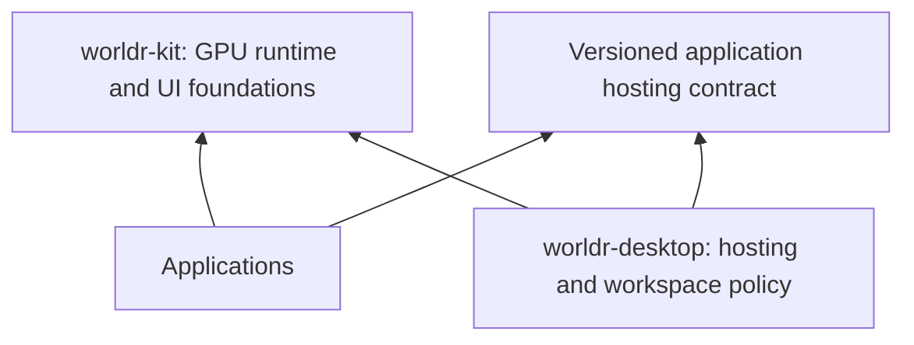

# WorldR: two products, one rendering foundation

WorldR is the umbrella project. Its two products are **worldr-kit**, a toolkit
for building GPU-rendered applications, and **worldr-desktop**, a desktop
environment that hosts applications.

Both initially live in this repository. Existing Go module paths and versioned
SDK imports remain stable during extraction.

## worldr-kit

The toolkit owns reusable application infrastructure: GPU rendering, retained
resources, 2D/3D scene composition, text and input, layout, controls, skins, and
application lifecycle. Desktop placement, launchers, workspaces and experiment
selection belong to the desktop product.

A kit application runs in an ordinary native window on an
existing desktop through `sdk/app/v1`, without starting the WorldR desktop. The same application
should be hostable by worldr-desktop through an explicit adapter. Application
behavior and documents should survive the choice of host and appearance.

The existing public building blocks are indexed in [the kit SDK guide](../sdk/README.md).
They are an initial foundation. The standalone API owns a Wayland/Vulkan
window, input, clipboard, display scaling, resource lifetime and frame pacing.
It shares the native renderer with the desktop and imports no workspace policy.
The portable UI painter still rasterizes controls on the CPU; a broader public
GPU control/layout library and an adapter between application hosts remain work.

## worldr-desktop

The desktop owns application hosting, window management, focus and routing,
workspaces, navigation, desktop preferences, saved sessions, and system
integration. It hosts kit applications and retains Wayland/X11 compatibility.

`cmd/worldr-desktop` is the product entry point. `cmd/worldr-shell` remains a
compatibility entry point using exactly the same implementation; existing
scripts and session-manager integration continue to work.

```sh
make build
./bin/worldr-desktop --backend=nested --state=dist/desktop/workspace.json
```

The current desktop includes experimental presentations. Their presence does
not establish everyday usability; reliable application workflows remain the
product priority.

[Future Panels](FUTURE-PANELS.md) develops the existing spatial desktop with
five native applications, layered glass chrome, movable windows and inertial
throws. Run `./scripts/run-future-panels.sh` or choose it from Experiments.

## Dependency rule

The target dependency direction is:



Kit code must not depend on desktop workspace policy. `sdk/app/v1` hosts
standalone applications directly through the native window and renderer layers.
The existing `internal/app` remains the desktop host, including workspace
services. Both use the same renderer implementation.

## First standalone application

[`worldr-terminal`](TERMINAL.md) is a separate standalone kit experiment. It
provides real PTY shell sessions, tabs, text selection, scrollback, clipboard,
keyboard focus, resizable native glass chrome and saved appearance preferences.
Its Vulkan window runs without workspace chrome or the experiment menu.
It remains available alongside the spatial desktop work.

The next host integration milestone is to host the same application through an
explicit adapter in worldr-desktop, preserving its state and input semantics.
The desktop's existing terminal provider already shares the PTY engine, but
does not yet host this standalone application's chrome and lifecycle directly.
Visual references remain examples and regression scenes.
