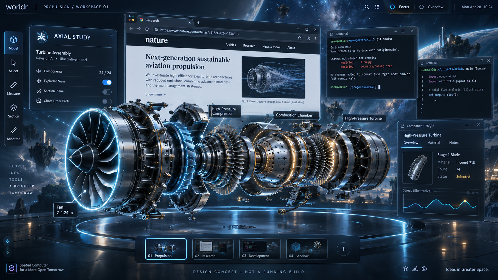

# worldr: a cinematic spatial workspace

worldr should feel like a credible computing environment from the future:
visually breathtaking, directly manipulable, and useful for sustained work.
Engineers, researchers, and everyday users should be able to bring their own
applications and work into the same environment.

The default visual direction is **mostly cinematic: Iron Man / Avatar**.
Depth, luminous structure, layered surfaces, detailed native objects, and
expressive motion should establish a strong identity. The default experience is
now the general workspace, with native terminals, Files, independently placed
photo/video viewers, file-backed 3D model inspectors and legacy applications.
AXIAL is also a hosted native 3D application in this workspace. The standalone
AXIAL presentation remains a deterministic renderer/interaction demonstration.

This document records the intended product and next acceptance milestone.
Implemented presentation and spatial controls are described below; cinematic
finish and broader everyday application workflows remain ongoing work.
The [next ten milestones](ROADMAP.md) provide the numbered development roadmap.

## The experience

A project occupies a persistent space. A person can arrange browsers, terminals,
documents, live instruments, and native 3D objects within it. Objects have useful
relationships: a chart can belong to a model, and several terminals can form a
group. Moving the group preserves its internal arrangement.

Moving something farther away changes its apparent size and its position behind
other objects. Foreground models and surfaces can occlude background windows.
An overview exposes hidden objects and groups so they are always retrievable.
Positions should remain understandable when moving between overview and work.

Windows have a visible grip above their content. Drag it to place a window, or
use Super+primary drag over content where the host desktop permits the shortcut.
An exposed bottom-right grip resizes the window with an ordinary primary drag;
Super+secondary drag over content provides the same continuous resize where the
host permits it. The requested logical size, spatial frame and client surface
change together, persist in the workspace document and restore on reconnect.
Win/Super + double-click on window content toggles that window's Read view; the
reserved clicks stay with the workspace rather than entering the application.
The three perspective-correct controls on the top grip minimize, toggle Read or
request closing that individual window. The square control performs the same
Read action as Win/Super + double-click. The exact Win/Super+C chord requests
closing the current active app even while it owns keyboard focus; its provider
may keep it open to confirm unsaved work. Minimize hides the content and its
complete frame; Overview and portals reveal and restore minimized windows.
Place mode also makes content draggable and offers Shift+click selection for
groups. Scrolling during a held drag moves the selection through depth without
introducing a lateral jump. Super+wheel changes the hovered window's depth
without focusing it; an explicit group moves with that window. The grips follow
perspective and visible scene occlusion, and hide in Read and Overview.

Releasing a moving window throws it in the direction of the drag. Exponential
deceleration slows it to a crawl before it stops; grouped windows keep their
relative arrangement. Clicking a moving window or its grip stops that window
or group; selecting, typing in, dragging or throwing another window leaves its
glide running. Multiple windows can coast independently. Escape from the
workspace stops gliding windows, while Escape in a focused terminal stays with
the terminal. Each held drag and subsequent glide form one undoable move in
gesture order. Escape during a held drag restores only that gesture's starting
placement. Reduced Motion disables
throws while preserving direct placement. Normal client dragging and scrolling
retain their application meaning outside the reserved workspace gestures.

Focusing an object brings it into a comfortable working view. Returning from
focus restores the previous spatial context. A terminal needs a readable,
nearly face-on view for typing; exploration can use more dramatic perspective.
Selection, keyboard focus, and camera focus are separate states with clear cues.
Camera movement must never silently change where a keystroke goes.
Super+primary dragging empty workspace pans the saved camera target horizontally
and vertically without moving windows. Empty unmodified drags remain inert. A fixed rotation pad in the
bottom-right corner owns that gesture and shows the current yaw and pitch; the
former center reticle and floor grid live inside this compact control instead.

The footer Help control and workspace F1 expose the current shortcuts in an
on-screen guide. It owns input while open; closing it leaves typing focus with
the workspace. Focused applications retain their own F1 behavior.

An existing application keeps its own content and behavior. A browser remains a
browser surface in the space. Native worldr experiences can expose models,
instruments, and controls directly into that same space.

Native apps are central to the product. The current worldr terminal runs a real
PTY shell with libvterm, selection, scrollback and ordinary terminal programs.
The native project browser opens real directories and previews text alongside
those terminals; it runs directly through the native application contract.
Searchable scrollback, bookmarks, optional OSC 133 command blocks, collapsible
output, pinned results, and explicitly dispatched task recipes now extend the PTY terminal. Native engineering, research, and everyday tools
should use the engine directly. Compatibility provides access to existing
software alongside those new experiences.

The workspace background includes a centered, vertical 3D DNA double helix rotating once
every 30 seconds. It is decorative retained geometry, rendered before application
content, so windows always cover it at any placement depth. Its pose is transient
and independent of camera navigation, saved layouts and Undo. Reduced Motion
freezes it in place, and Adaptive Read fades it out.

Opening a video from native Files starts playback in a new independent window
without changing keyboard focus, selection, camera or Read mode. A new player
uses the workspace's normal initial placement.
The native player uses a layered teal chassis with fine cyan rails, raised tabs,
segmented transport keys and a separate volume deck. A hexagonal thumb marks the
live timeline; paused video shows a concentric-ring play button. The dark hex grid
and technical edge details surround the picture, leaving playing frames clear.
Controls include play/pause, stop, ten-second skips, mute and volume.
Space toggles playback, Left/Right skip,
and M mutes. Return to Space preserves playback while the player can be moved,
grouped or thrown like any other window. Opening a different video creates another player (up to four). With `--state`, its local file,
playback position, pause, volume and mute settings resume on the next launch.

Photos open from Files with an open cyan bracket: a left rail with partial top
and bottom returns, leaving the right side open. The bracket sits outside the
image; there is no title bar, drag grip or image toolbar. Click and drag the photo itself to move or throw it through
the workspace. The surface follows the photo's aspect ratio, showing the whole
image without a surrounding matte. JPEG, PNG, WebP, BMP and the first GIF frame
are supported, including automatic JPEG EXIF orientation. There are no manual
zoom, pan, rotation, resize or window-chrome controls; this preserves the
deliberately minimal viewer requested for photos. Images decode on one bounded worker; canceled or
superseded loads cannot replace newer content. Opening another photo creates another independently placed viewer (up to eight). Failed
loads show a minimal error message. Neither loading nor completion takes focus
or moves the workspace camera.

## Selectable presentation

Both modes use the same engine, data, tools, and interaction capabilities:

| Mode | Exploration | Focused work |
| --- | --- | --- |
| Cinematic (default) | Expressive spatial framing, lighting, and visible instruments | Cinematic framing remains prominent |
| Adaptive | The same cinematic exploration | Surrounding detail recedes to emphasize the active content |

The header selector or P switches between these modes in both experiences.
Cinematic retains spatial framing and brighter accents. Adaptive calms those
accents for application Read mode, and for AXIAL's model focus, then restores
them when returning to exploration. The preference is persisted with an explicitly configured
document; the fade is transient presentation state. Reset preserves the choice,
and mode changes participate in undo/redo without rewinding unrelated playback.
The independent **Reduced Motion** header control (Shift+P from the workspace)
completes explosion and framing transitions immediately and disables window
throws. It is persisted,
undoable and preserved by reset. Study playback and application content keep
their own controls; Space pauses the study.

The current material pass adds camera/light-responsive highlights, metal tint,
cyan rim accents, two bounded moving fill lights and smooth cylindrical shading
in a cool blue/silver palette.
A procedural grid and rings anchor the model in world space; they hide for
application Read/Overview and fade during Adaptive focus. Selective GPU glow adds
soft background halos to active window borders, sparse guides and housing light
bands. Occluded fragments do not emit; opaque apps cover the glow so their content
stays sharp. Adaptive focus removes the halos while preserving its focus border.
The renderer also supplies opt-in bounded final-frame highlight bloom and an SDR
exposure/saturation/contrast finish. The workspace does not apply that global
finish to its mixed compositor frame: doing so would recolor legacy app buffers
and opaque UI, while a cursor appended by the host could bloom outside its input
bounds. Cinematic still drives its moving fill lights and depth-aware authored
glow; Adaptive focus fades those effects to neutral. Depth-peeled meshes can opt
into a thin-glass material that retains specular/rim response while reducing
diffuse body color. Lit transmitted glass can also opt into bounded refraction
of the opaque scene, including a fixed-cost frosted blur. The backdrop excludes
screen overlays and the host cursor, and zero refraction preserves the prior
transmission result and exact client/legacy texture pixels. Physical HDR and
calibrated ICC/wide-gamut output remain design targets. Switching modes does not
require a different engine or workspace rebuild.

Native translucent meshes can also opt into a depth-composited holographic
projection. World-space scan bands and view-angle transparency retain actual
scene occlusion, while a narrow opaque-depth contact cue anchors the projection
to nearby solid objects. Reduced Motion freezes the workspace-owned scan phase.
The effect is confined to that mesh shader: application/control pixels, legacy
buffers, shaped overlays and the host cursor remain unchanged. It is a bounded
surface illusion rather than volumetric scattering or physically emissive light.

## Visual direction

| Element | Direction |
| --- | --- |
| Space | Strong foreground, working plane, and background; clear occlusion and spatial landmarks |
| Light | Luminous edges and controlled bloom around selection and important objects |
| Surfaces | Layered glass-like borders with solid, high-contrast text areas |
| Color | Dark graphite and deep blue; ice-blue/cyan structure; restrained warm selection accents |
| Objects | Detailed materials, readable silhouettes, meaningful annotations and connected instruments |
| Motion | Continuous transitions for placement, focus, grouping, and navigation, with interruptible input |
| Typography | Precise technical hierarchy with readable body text and terminal glyphs |
| Detail | Information and controls tied to real state; every instrument has a purpose |

Cinematic expression is the default direction. Reading comfort, keyboard access,
and a reduced-motion setting belong in the product requirements from the start.
Technical depth must remain discoverable through simple controls. No knowledge
of 3D software should be required to retrieve a window or resume typing.



Design concept generated with the built-in image tool. Application contents are
illustrative; this is an aspirational design artifact rather than a screenshot
of the running renderer. The [complete prompt](concepts/cinematic-workspace-v1.prompt.md)
records the initial composition and constraints.

## First complete workflow

Start the default general workspace with real project data and a native shell:

```sh
./bin/worldr-shell --backend=nested --project=. --terminal --state=documents/workspace.json
```

The fixed APPS rail on the right launches Files, Terminal, Photo, Media, Model,
Research, Notes, and AXIAL. Photo, Media, Model, and Research reuse Files as a filtered
chooser so the user can navigate folders before opening content in the native
viewer. Ctrl+Alt+Space opens the searchable launcher for the same tools and all
live windows.

`--project` anchors a native Files browser at that directory. Select a file
to preview UTF-8 text with line numbers. Enter, double-click or Open enters a
directory; Backspace or Up returns toward the root. Tab switches panes; arrow
keys select files or scroll/pan the preview, and wheel/Page Up/Page Down scroll.
Refresh, F5 or Ctrl+R reloads the listing. Copy path or Ctrl+Shift+C explicitly
copies the selected path to the clipboard.

Terminal Here or Ctrl+Shift+Enter opens a separate native terminal in the selected
directory, or in the current directory when a regular file is selected. Files
retains its selection, typing focus and camera view while the terminal opens.
Click the new terminal to type. A borrowed directory descriptor anchors startup
to the folder actually opened by the browser, including across a rename.

Listings and previews run on a worker with bounded requests. The browser shows
at most 5,000 entries and the first 1 MiB of a text file, with truncation notices.
It lists symlinks without following them below the chosen root, and previews only
regular text files. Ctrl+F filters the current folder, visible image rows receive bounded thumbnails,
and a 2-second refresh notices changes. New folder, Rename, Move, Duplicate,
Trash, Restore and Undo provide anchored file operations with explicit errors.
Recursive content search, text editing and syntax highlighting remain ahead. Photos and videos
open in their native viewers. With `--state`, Files restores its root, current
folder and selected item. An explicit different `--project` overrides the saved
root; repeating the same root retains its navigation.

Launch again with only `--state=documents/workspace.json` to reopen the saved
native windows and arrangement. The session manifest records Files navigation,
photo/video paths and playback settings, and native terminal working folders.
Terminals start fresh shells in their stable slots; commands, jobs and screen
history are not replayed. Legacy apps still launch only through explicit
`--app` arguments or an `--apps` profile. Version-1 layout files remain readable;
new saves use a version-2 envelope containing layout and native session data.

Autosave defaults to `--autosave=5s` when `--state` is configured; `0` disables
periodic writes. `PATH.autosave` is used if it is newer and valid, or the primary
is missing or invalid. An invalid recovery falls back to a valid primary with
a notice. Manual save and normal exit replace the primary and clear recovery.
`PATH.lock` prevents concurrent use of the same state path. `--fresh` skips saved
native apps and recovery while loading the primary layout and explicit CLI apps.
Missing resources produce notices and remain pending with their saved placements
for a later launch; a missing Files subfolder falls back to the project root.

Open AXIAL from the APPS rail or pass `--axial` to host its procedural assembly,
live instrument, picking and playback as an ordinary spatial application. Its
stable application state survives workspace save/restore. Closing it retires
its panel texture and all four procedural mesh buffers; reopening builds fresh
resources, so an empty workspace does not retain a closed study. For the deterministic
full-screen engineering demonstration, use `--experience=axial`; `--demo` selects
that presentation automatically when no experience is explicitly supplied. It hosts
**multiple real terminals and a native 3D object** together. The general
workspace contains no synthetic model, timeline or instrument allocations.
Typing, free placement and throws, group movement, depth,
read/return, overview retrieval, client resize and saved layout are implemented.
Clipboard exchange connects native terminals, legacy clients and the host desktop
in a nested session. Native terminals have independent shells and input focus;
**New Terminal** or Ctrl+Alt+Enter creates one without restarting worldr,
including when no apps are open or another app has input focus.
Launching selects the window; a click or a fresh Enter from the workspace
explicitly grants typing focus. Enter also opens Read for the selected window.
**Close Selected** or the exact Win/Super+C chord requests closing only the active
window, even within a selected group. The chord remains available while that
app owns keyboard focus. A provider can keep the window open for an unsaved-work
confirmation. Shells
that exit naturally keep their final output until explicitly closed.

**Chromium** and **Konsole** have isolated real-client tests for typing, menus,
nested submenus, dismissal, drag-and-drop and separate dialogs on the private
Wayland host. The software-client cases use SHM; a separate real GBM test covers
the supported explicit-modifier DMA-BUF path, including non-LINEAR input when
the Vulkan device advertises it. Popup pixels
remain inside the root application's image; full everyday compatibility remains
under development.
Client-supplied transparent, scaled and hidden cursors follow pointer hover and
capture independently of keyboard focus. The workspace restores its arrow over
its own controls, overview, placement and Help.

1. Launch a real terminal, run a shell and a terminal editor, and use their normal
   keyboard behavior, including key repeat, scrolling, and text selection. The
   displayed output must come from the running process.
2. Place the terminal beside a native model. Move it behind the model and confirm
   that both rendering and pointer targeting respect the same visible surfaces.
3. Bring the terminal into focus, type comfortably, and return it to its prior
   position. Moving a surface in space is separate from resizing its application.
   Resize it and verify terminal/editor reflow, including after focus and return.
4. Retrieve it through an overview when it is completely obscured. Ctrl+Alt+O
   works while an application owns the keyboard. Unmodified arrows select live
   thumbnails one step per fresh press. Enter/keypad Enter or Escape returns to
   the prior space/read view without granting application input focus; a second
   fresh Enter opens Read and grants focus. Held keys cannot leak into the app.
   Group two windows,
   move the group, and preserve their relative positions.
5. Run Chromium, interact with a page, open its menus, and use dialogs and
   clipboard across the browser and terminal. These must be application behavior,
   not illustrative controls drawn by worldr. Resize the browser and verify page
   layout both in the workspace and after focus/return.
6. Save and reopen the workspace with its object/group positions, Files location,
   photo/video and terminal folders. Terminal locations use fresh shells;
   arbitrary running processes, shell jobs and browser memory are not serialized.
7. Close an application and leave the workspace responsive. An application crash
   must not destroy unrelated work or invalidate the spatial layout.

Visual polish should develop alongside this workflow. Its acceptance requires
both the cinematic presentation and ordinary work remaining reliable.

## Implementation sequence

| Step | Deliverable | Evidence |
| --- | --- | --- |
| General workspace (implemented) | Default desktop experience, application controls and an empty state independent of AXIAL; a separate persistence identity | Desktop lifecycle, action isolation and state round-trip tests |
| Native project browser (implemented) | Real directory navigation, bounded search/thumbnails, refresh, keyboard/pointer controls, new folder, rename, move, duplicate, trash/restore and Undo | Reader/provider/rendering tests, FD anchoring, cancellation and race coverage |
| Content surface foundation (implemented) | Versioned RGBA images, opaque textured planes sharing depth with native geometry, and local-coordinate pointer mapping | Scene/GPU tests, the live AXIAL instrument panel, hosted native tools and compatibility surfaces |
| Legacy application host (implemented subset) | Private Wayland/Xwayland hosts, SHM and supported DMA-BUF content, raw input, depth/read/size controls | Real foot/Chromium/Konsole/xmessage output, input, popup, DnD, resize, clipboard and disconnect tests |
| Native terminal workflow (implemented) | Independent PTY/libvterm shells, native presentation, New Terminal / Close Selected, and text clipboard | Real shell/Vim, job control, resize, GPU display, close/reopen, private GUI launch and clipboard tests |
| Resume actual work (implemented) | Versioned native session manifest, Files/viewer restoration, fresh shells in saved folders, autosave recovery and one-writer session lock | CPU/GPU/real-media/compatibility suites and race checks; repeated state-only startup and forced-stop recovery without duplicate terminals |
| Spatial interaction (implemented) | Visible grips, direct dragging and throwing, depth movement, grouping, overview, focus/return, and local-coordinate input mapping | Direct-drag ownership/occlusion/cancellation tests, timed throw deceleration and frame-rate independence, one-edit group undo, real two-foot GPU workflow, saved layout round-trip and sibling exit |
| Browser compatibility (selected workflows tested) | Chromium/Konsole content, typing, popup menus, DnD, separate dialogs, fractional scaling and teardown | Isolated real-client tests; broader everyday browser workflows still need acceptance |
| Cinematic finish (bounded SDR slice implemented) | Directional and point-light highlights, metal/rim/thin-glass materials, bounded opaque-backdrop refraction/frost, depth-composited holographic projections with a frozen Reduced Motion phase, smooth normals, world-space guides and authored glow; opt-in renderer bloom/SDR grading stay neutral on mixed compositor frames; physical HDR/ICC and volumetric scattering remain | GPU material/output/scene tests and reviewed captures; the default one-hour, three-process restart trial records sustained frame/resource timing, while physical input-to-photon measurement remains |

The application host translates protocol buffers and events into generic scene
content. Linux protocol state stays outside the renderer. The workspace owns
spatial arrangement and focus policy. A compatibility buffer upload may be
needed for some clients; the scene must not depend on full-frame GPU readback.
With a validated renderer render node, linux-dmabuf v4 supplies a sealed
exact-pair format table plus main and tranche device feedback. Device-less
compatibility registration remains on version 3.

Existing X11-only applications use the opt-in private Xwayland bridge. Its
authenticated surfaces become ordinary scene content and do not define the
workspace architecture. The X11 `CLIPBOARD` selection uses the shared lazy
clipboard broker. Capability-gated glamor imports Xwayland DMA-BUF surfaces on
the renderer's exact DRM device and retries with SHM when unavailable. Managed
X11 windows support copy-only XDND versions 3–5; cross-protocol X11/Wayland
drags remain outside the implemented subset. Voice and gesture interaction can later invoke
the same explicit actions as keyboard and pointer input.

## Present boundary

The current renderer has retained meshes with per-instance direct-light
materials and RGBA content surfaces, GPU transforms and lighting, ray picking
with surface pixel coordinates, screen-space text/UI, and Vulkan presentation.
The general workspace has placement actions, undo and its own document schema;
The standalone AXIAL harness retains separate study actions and persistence;
the hosted AXIAL application belongs to the normal workspace manifest. Workspace documents use
the `worldr.workspace` identity, while study documents use `worldr.axial`.
They require separate state files and reject each other's payloads. Workspace
state stores camera, presentation/motion preferences, application layouts and a
host-owned native resource manifest;
study time, component selection and panel depth belong only to AXIAL.
Manual saving cancels an unfinished held drag, or stops a released throw at its
current position. Autosave excludes unfinished gestures and captures released
windows at their current positions without stopping them. Throw velocity is
never persisted or replayed; Files navigation belongs to the session manifest.
AXIAL's live instrument panel shares the model's depth buffer, supports
playback and scrubbing, and can move between front and rear placements with B.
Surface pixels update independently of scene geometry and camera movement.

Surfaces remain opaque by default. Explicit translucent surfaces use bounded
per-pixel depth peeling; lit transmitted meshes can locally refract the opaque
scene with bounded bend and blur. Models support directional shadows and linear
color.
`--app=foot` connects a real terminal through the new, separate Wayland server.
The workspace displays multiple applications with placement, groups, overview,
depth, read/return and client resize controls. Layouts retain stable launch/window
keys across reconnects. The bounded cinematic SDR finish is implemented;
broader desktop compatibility and physical HDR/color-management work remain.
The nested Wayland display host remains a client used to present worldr; it is
separate from the compatibility server hosting foot.

Native terminal rendering consumes terminal cells directly, without a Wayland
client. Its shell inherits worldr's private Wayland socket so compatible GUI
programs can become additional workspace surfaces. Native terminals currently
use Go Mono with bounded Fontconfig fallback for missing glyphs on Linux and
rasterize changed glyph rows into retained RGBA images. Installed font coverage
is required. Shared native controls use shaped text and nested IME, and the
terminal offers search/bookmarks, command blocks, pins and reusable task recipes.
Terminal cell composition and color emoji remain ahead. The public native-app
v1 SDK is available for independently built tools.

The workspace displays at most 32 live windows and retains 32 saved placements.
Closing a window preserves its placement; reused native launch slots recover
that association. Old saved placements can exhaust capacity even with few live
windows. Launch errors have a temporary visible notice; an unplaceable new
terminal is closed without discarding existing layout. Launch/close actions and
notices stay outside document undo. Sessions remember native resource references;
live keyboard focus and running processes are not serialized.

**Forget Closed Placements** explicitly frees saved positions of closed windows,
including from an otherwise empty workspace. Live windows keep their positions,
groups and selection. The action is undoable without losing subsequently opened
windows; restoring too many entries is refused with a notice. Redo protects
windows reopened since the original cleanup. Remembered positions are never
deleted automatically. Forgetting a closed key also drops any pending session
reference for that placement on the next save.

Clipboard contents are requested lazily. Native paste is text-only, bounded to
1 MiB and two seconds, and cancelled when its original terminal loses focus.
Primary selection, cross-protocol X11/Wayland drag-and-drop and arbitrary
DMA-BUF format/modifier import are not implemented. Wayland drag-and-drop,
managed X11-to-X11 copy drags, a capability-gated single-plane
XRGB/ARGB/XBGR/ABGR DMA-BUF subset and private Xwayland glamor with SHM fallback
are implemented and covered by real-client tests.

[The stable ten-item roadmap](ROADMAP.md) records implementation and validation
status. Broader compatibility remains future expansion; physical platform
qualification is deliberately pinned in the product backlog.

## Named spaces and native tools

Click **TOOLS + SPACES** or press **Ctrl+Alt+Space** to search tools, windows and
spaces. Type a new name to create a space or rename the current one. Each of the
16 spaces retains its own camera, arrangement and contents. Existing tools keep
running when their space is hidden. The menu can transfer the selected window
or group; Undo returns it. Switching a space does not assign keyboard focus.
Opening an existing window through the launcher is an explicit focus action.

The portal atlas is the fast path across that larger workspace. Click **PORTALS**
or press **Ctrl+Alt+G** from either workspace or application focus. Each card is
derived from a live group and its named space; an ungrouped window is its own
portal, and an empty named space retains a destination card. Arrow keys select,
Enter travels, Escape closes, and Ctrl+Alt+Left/Right travels directly between
portals. Travel switches space when needed, selects the destination group and
centers a fitted camera target without changing any placement. It never grants
client keyboard focus. The entire trip is one undoable edit, and camera targets
round-trip through workspace state and graphics recovery.

Zooming the camera never places application-name cards over the workspace.
Portal discovery remains explicit through the footer atlas and reserved
shortcuts, so application pixels and their surrounding space stay unobscured.

Open triangle OBJ, STL or `.worldr-model.json` from Files, or supply repeatable
`--model=PATH`. Model inspectors share the workspace's geometry/depth/picking
pipeline. Drag to orbit, scroll to zoom, use the component list (scroll for more,
Page Up/Down selects components), Measure to choose two surface points, and
Annotate to attach text. Ctrl+S/Save writes the tool document separately from the
model; workspace save records each inspector's source/view/annotations too.

Terminal controls: Ctrl+Shift+F Find, Ctrl+Shift+M bookmark current line,
Ctrl+Shift+B bookmarks, Ctrl+Shift+K command blocks, Ctrl+Shift+P pinned results,
Ctrl+Shift+R pin visible/selected output, and Ctrl+Shift+T Tasks. In Runs, Enter
folds a block, P pins it, and T saves its command as an inert task. In Tasks, S
stages a command without Enter and Ctrl+Enter explicitly executes it. Optional
shell integration is offered as a copyable Bash setup; it is never executed
automatically. These tools stay out of alternate-screen programs and remain
bounded. [Task workflow details](TERMINAL-WORKFLOWS.md) cover persistence and
dispatch behavior.
